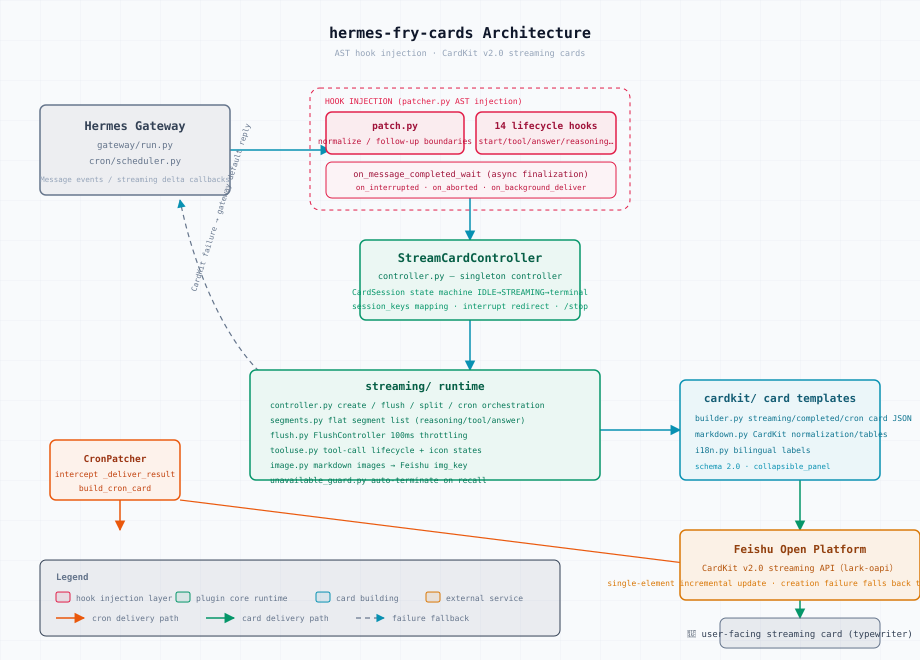

# 🍟 hermes-fry-cards (薯条卡片)

[](LICENSE)
[](https://github.com/NousResearch/hermes-agent)
[](https://www.python.org/)
[](https://github.com/techysy/hermes-fry-cards/releases)

> 🍟 Hermes Gateway plugin for real-time streaming Feishu/Lark CardKit v2.0 cards

[中文文档](README.md) · [Installation Guide](INSTALL.md)


---

## ✨ Features

| Feature | Description |
|---------|-------------|
| 🎴 **Streaming card** | Real-time typewriter output; dynamically renders thinking / tools / answer in order |
| 🔧 **Merged tool-use panel** | Multiple tool calls combine into a single unified panel |
| 🧠 **Reasoning display** | Shows model thinking/reasoning via tags, prefixes, or native API blocks |
| 🎯 **Unified panel** | Reasoning + tools merged into one bottom panel with model name, round count, tool count, duration |
| 📊 **Completion card** | Final card with token usage, duration, context window |
| 🖼️ **Image resolution** | Auto-detects markdown image refs, downloads & re-uploads as Feishu img_key |
| 🛡️ **Message guard** | Auto-terminates updates when message is deleted/recalled |
| 📤 **Auto card split** | Splits into multiple cards near Feishu's 200-element limit |
| 🔔 **Cron delivery** | Delivers scheduled job results as Feishu cards with Markdown |
| 🔙 **Background delivery** | Delivers `/background` (`/btw`) task results as cards |
| 🌐 **Bilingual** | Card text auto-switches based on Feishu client language |
| 🎨 **Customizable** | Header/footer, text sizes, width mode, footer fields |
| 🎯 **Status border** | Header auto-colors by state: blue streaming, green completed, red error |
| ⏱️ **Quick-reply trim** | Hides the status header when no tool calls and duration is under a threshold |
| 🛡️ **Group security boundary** | Group @bot replies get an output boundary (no keys/passwords/internal IPs); DMs unaffected (modular Hermes 0.21+, editable in Studio) |
| ❓ **Clarify button cards** | Option questions render as clickable button cards (single/multi-select + "other" inline input + toast) |
| 🔐 **Approval click fix** | Approval buttons use interactive-callback auth (upstream misused group admission policy and swallowed clicks), with accept/expired/denied toasts |
| 🎛️ **Studio workbench** | `studio` command launches a local Web UI: config forms + **real-builder preview** (4 scenarios × 3 states) + status diagnostics & one-click restart; safe write-back pipeline |
| 🏷️ **Model alias time-persona** | `model_aliases.json` substring matching + Beijing-time time-window objects auto-switch display names (DeepSeek peak/valley), openclaw-compatible, editable in Studio |
| 🧱 **Markdown guard engine** | Overflow tables losslessly compacted to field lists + 18KB byte budget (progressive streaming trim / head+tail preserved on seal) — no more ~30KB card JSON overflow |
| 🔀 **Interleaved workflow rendering** | Completion panel interleaves reasoning and tool groups in true arrival order (💭→🔧→💭→🔧) |

## 🏗️ Architecture

<picture>
  <source media="(prefers-color-scheme: dark)" srcset="assets/architecture-en.svg">
  
</picture>

---

## 🚀 Quick Install

### One-line install (recommended)

```bash
curl -fsSL https://raw.githubusercontent.com/techysy/hermes-fry-cards/main/install.sh | bash
```

The script locates Hermes's venv Python, installs the package, runs `verify`, and injects the hooks — then tells you to restart the gateway.

```bash
# Pin a version (default: main)
curl -fsSL .../install.sh | FRY_REF=v0.4.0 bash
# Override the interpreter if auto-detection misses
curl -fsSL .../install.sh | HERMES_PYTHON=/path/to/python3 bash
```

> ⚠️ The script never restarts the gateway itself (a restart from inside a gateway turn would kill it). Run `hermes gateway restart` yourself afterwards.

### AI Agent one-liner

```
curl https://raw.githubusercontent.com/techysy/hermes-fry-cards/main/INSTALL.md
```

### Manual install

```bash
# GitHub (primary)
git clone https://github.com/techysy/hermes-fry-cards.git
# or Gitee mirror (faster in CN)
git clone https://gitee.com/techysy/hermes-fry-cards.git

cd hermes-fry-cards
HERMES_PYTHON=~/.hermes/hermes-agent/venv/bin/python3
$HERMES_PYTHON -m pip install -e .
$HERMES_PYTHON -m hermes_fry_cards verify
$HERMES_PYTHON -m hermes_fry_cards install
hermes gateway restart
```

---

## ⚙️ Configuration

```yaml
streaming:
  enabled: true
  chat_types: [dm, group]  # Allowed chat types for cards; default = all types (omit to keep old behavior)
  header_enabled: true
  footer:
    enabled: true
    fields:
      - [status, elapsed, model, context]
display:
  platforms:
    feishu:
      show_tool_use: true
      show_reasoning: true   # Enable reasoning display
```

| Option | Description | Default |
|--------|-------------|---------|
| `header.enabled` | Status header bar | `true` |
| `header.min_duration` | Quick-reply trim threshold (seconds, 0 = always show) | `0` |
| `footer.enabled` | Footer metadata bar | `false` |
| `panel_expanded` | Keep completion panels expanded | `false` |
| `chat_types` | Allowed chat types for cards (`dm`/`group`...); omit = all types. Types outside the list fall back to plain text | all (omit) |
| `content_lang` | Language for in-content notices (table compaction / truncation): `zh` / `en` | `zh` |
| `width_mode` | Card width (`default` / `compact` / `fill`) | `default` |
| `show_tool_use` | Show tool-use panels | `true` |
| `show_reasoning` | Show reasoning process | `false` |
| `model_aliases_enabled` | Master switch for model aliases; `false` falls back to truncation (config kept) | `true` |
| `gateway.group_security_boundary.enabled` | Group security boundary master switch (output boundary on group replies; DMs unaffected) | `false` |
| `gateway.group_security_boundary.allow_chats` | Exempt-group whitelist (`oc_xxx`, one per line; listed groups skip the boundary) | `[]` |

---

## 🖥️ CLI

```bash
HERMES_PYTHON=~/.hermes/hermes-agent/venv/bin/python3
$HERMES_PYTHON -m hermes_fry_cards verify     # Verify compatibility
$HERMES_PYTHON -m hermes_fry_cards install    # Inject hooks
$HERMES_PYTHON -m hermes_fry_cards uninstall  # Remove hooks
$HERMES_PYTHON -m hermes_fry_cards status     # Show status
$HERMES_PYTHON -m hermes_fry_cards studio     # Visual config studio (127.0.0.1:8765)
```

---

## 📝 Update / Uninstall

### Update

```bash
cd hermes-fry-cards && git pull
HERMES_PYTHON=~/.hermes/hermes-agent/venv/bin/python3
$HERMES_PYTHON -m pip install -e .
$HERMES_PYTHON -m hermes_fry_cards uninstall
$HERMES_PYTHON -m hermes_fry_cards install
hermes gateway restart
```

### Uninstall

```bash
HERMES_PYTHON=~/.hermes/hermes-agent/venv/bin/python3
$HERMES_PYTHON -m hermes_fry_cards uninstall
$HERMES_PYTHON -m pip uninstall hermes-fry-cards
```

---

## 🧠 How it Works

```
User sends message
  → Card session created
  → Streaming updates (tool status, text — throttled)
  → Image URL async resolution
  → Completion card (tokens, duration, context)
```

---

## 🔄 Differences from upstream hermes-lark-streaming

This project is independently developed based on [Cheerwhy/hermes-lark-streaming](https://github.com/Cheerwhy/hermes-lark-streaming) v0.12.0. The core streaming engine keeps the upstream AST hook injection architecture, enhanced in three layers:

### ✨ New features

| Feature | Description | Upstream |
|---------|-------------|----------|
| **Unified panel** | Merges reasoning + tool calls into a single bottom panel; `unified_panel_min_duration` auto-hides it when there are no tool calls and the reply is quick | ❌ Reasoning panels stack separately, verbose for multi-round chats |
| **Context progress bar** | Independent `show_context` switch + `context_display_mode` with three modes (`text` / gradient-shaded `bar` / `text_bar`), smart units (k below 1M) | ❌ Footer plain-text percentage only, no toggle |
| **Reasoning panel cap** | `max_reasoning_panels` (default 3); overflow merges into the last panel — supports models without segmented thinking (e.g. deepseek-v4-flash), prevents 300305 element overflow | ❌ Uncapped, long thinking always overflows |
| **Model name truncation** | `truncate_model_name`: `nvidia/moonshotai/kimi-k3` → `⇲kimi-k3`, fixes mobile line wrapping | ❌ Full name shown |
| **Model aliases (time-persona)** | Standalone JSON config at `~/.hermes/model_aliases.json`: `{"mimo": "小虾米"}` substring matching, or time-window objects `{"deepseek": {"name": "梁文谷⚡️", "timeAliases": [{"days": [1,2,3,4,5], "start": "09:00", "end": "12:00", "name": "梁文锋⚡️"}]}}` resolved on fixed Beijing time (UTC+8, half-open windows, cross-midnight, `name` fallback) — byte-compatible with openclaw/claw-fry-cards. Master switch `display.model_aliases_enabled` (hot-reloaded); editable in Studio | ❌ None |

### Model alias config

Independent of `config.yaml`, aliases are written in `~/.hermes/model_aliases.json` (or edited visually in **Studio → 配置 → 模型别名**):

```json
{
  "longcat": "哈基米",
  "mimo": "小虾米",
  "deepseek": {
    "name": "梁文谷⚡️",
    "timeAliases": [
      { "days": [1, 2, 3, 4, 5], "start": "09:00", "end": "12:00", "name": "梁文锋⚡️" },
      { "days": [1, 2, 3, 4, 5], "start": "14:00", "end": "18:00", "name": "梁文锋⚡️" }
    ]
  }
}
```

- **Match**: keys are case-insensitively substring-matched against the full model name (`longcat` → `or/lc/LongCat-2.0` hits), first hit in insertion order wins
- **Time-persona objects**: resolved on fixed Beijing time (UTC+8, host-timezone independent); `days` as array (0 = Sunday) or `"1-5"` / `"0,6"` strings; windows are `[start, end)` half-open with cross-midnight support; no hit falls back to `name`
- **Priority**: alias hit → show alias; miss → fall back to truncation; `display.model_aliases_enabled: false` disables aliases entirely (config kept)
- **Hot reload**: re-read on every render, takes effect immediately on file change

> Full path: `~/.hermes/model_aliases.json`

Behavior default: `show_reasoning` defaults to **true** (upstream defaults to false).

### 🔧 Key fixes (upstream pitfalls)

- **300305 element-limit forced split recovery** — when total card elements exceed Feishu's hard limit, automatically seals the old card and migrates un-created segments to a new one to continue streaming; no longer stuck at "processing" forever
- **Remote image URL filtering** — works around CardKit rejecting remote URLs (`200570 invalid image keys`) by stripping un-uploadable references into code fences
- **Duplicate ID fix system for completion cards** — reasoning `text_el_id` reused end-to-end with indexed unique-ID fallback; upstream's fixed `reasoning_text` collides with streaming-phase elements and leaves cards stuck loading
- **Loading icon cleanup on seal/complete failure** — failed finalization no longer leaves a "processing" state behind

### 🏛️ Internal stability refactor (v0.1.1)

- Unified session lifecycle entry points (idempotent registration/cleanup), interrupt takeover no longer deletes new session mappings, terminated sessions can be rebuilt
- FlushController race protection: completion snapshot prevents redundant reflush, stale timer cancellation prevents double flush
- Traceable failure reasons via `mark_failed(reason=...)` + structured log events + `_yield_to_gateway` as the single fallback decision point
- 15 test files with 9 new stability regression tests; CONFIGURATION / TROUBLESHOOTING docs included

---

## 📄 Attribution

Inspired by [hermes-lark-streaming](https://github.com/Cheerwhy/hermes-lark-streaming) (author Cheerwhy), licensed under MIT. This is an independent development with architecture rewrite and feature enhancements.

## 📄 License

[MIT](LICENSE)
