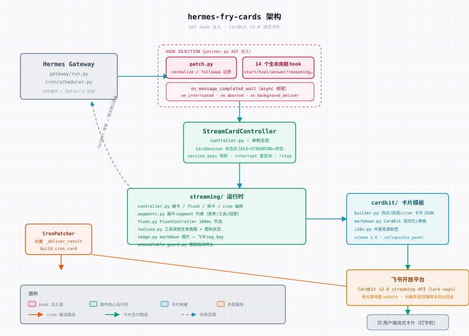

<div align="center">

# 🍟 hermes-fry-cards — 薯条卡片

**Hermes Gateway 飞书 / Lark 流式卡片插件：CardKit v2.0 实时打字机流式输出 · 思考与工具交错统一面板 · Markdown 防爆引擎 · Studio 可视化工作坊**

[](https://github.com/techysy/hermes-fry-cards/releases/latest)
[](https://github.com/NousResearch/hermes-agent)
[](https://www.python.org/)
[](LICENSE)

[安装](#-快速安装) · [特性](#-核心特性) · [配置](#%EF%B8%8F-配置) · [Studio 工作坊](#%EF%B8%8F-studio-可视化配置工作坊) · [工作原理](#-工作原理) · [排障与热更新](#-热更新--网关重启说明) · [更新日志](CHANGELOG.md) · [English](README.en.md)


</div>

> **这是什么**：一个专为 [Hermes Agent](https://github.com/NousResearch/hermes-agent) Gateway 定制的**飞书流式卡片插件**。通过底层 AST hook 注入机制，在不侵入破坏 Hermes 核心的前提下，将 Agent 的每一次输出升级为飞书 CardKit v2.0 流式互动卡片。  
> **设计哲学**：拒绝漫长空白等待，打字机实时上屏；收敛繁杂的思考链与工具调用，统一归入底态折叠面板。

---

## 🏗️ 架构总览

<div align="center">

<picture>
  <source media="(prefers-color-scheme: dark)" srcset="assets/architecture.svg">
  
</picture>

</div>

---

## ✨ 核心特性

### 1. 🍟 极致流式卡片体验
- ✍️ **动态打字机效果**：Agent 生成过程实时逐字渲染，状态感知顶部 Header 自适应着色（流式中蓝 · 完成绿 · 中断/出错红）。
- 🔀 **工作流交错渲染**：按真实时间线顺序精确交织展现思考推导与工具组（`💭 → 🔧 → 💭 → 🔧`），过程一目了然。
- 🎯 **统一折叠面板**：思考过程与工具流水收归底部单条折叠栏，折叠态一行带全核心指标：`🍟 ⇲模型 · 💭N · 🔧N · 上下文 (x%) · ⏱️耗时`。
- ⏱️ **快捷回复去标题**：无工具调用且耗时低于阈值时，自动隐藏顶部状态栏，保持简短答复清爽纯粹。
- 🏷️ **模型别名与时段人设**：支持按北京时间自动切换展示名（如 DeepSeek 峰谷价标识：峰段`梁文锋⚡️` / 谷段`梁文谷⚡️`），配置格式与 openclaw 互通。

### 2. 🛡️ 生产级防爆与稳定性保障
- 🧱 **Markdown 防爆引擎**：超限表格智能无损重排为字段列表；设置 18KB 字节级预算，杜绝飞书卡片约 30KB 溢出断屏。
- 📤 **智能拆卡与恢复**：卡片元素逼近飞书 200 个上限（`300305`）时，主动封印旧卡并开启新卡续流，绝不永久停滞在 loading。
- 🛡️ **群聊安全边界（modular Hermes 0.21+）**：群内 @bot 时自动挂载安全边界，严防泄露 API Key、内网 IP 与敏感凭据（支持白名单群放行）。
- 🖼️ **内嵌图片自动转换**：智能提取 Markdown 远程图片链接，后台自动转存上传为飞书专用 `img_key`，避免外链屏蔽与破损。

### 3. 🎛️ Studio 可视化工作坊
- 🎨 **开箱即用 Web 控制台**：运行 `studio` 命令即可调起纯标准库实现的管理页面，提供完整表单化配置。
- 👁️ **真实 Builder 渲染预览**：非前端模拟，直接调用后端核心 Builder 实时渲染 4 大典型场景 × 3 种生命周期卡片。
- 🔒 **写回安全五件套**：严格格式校验、拒写防护、20 份自动备份轮转、白名单键深合并、临时文件原子落盘。
- 🔁 **守护自启与保活**：自带 systemd 用户服务单元，支持开机启动与进程崩溃自愈。

---

## 🚀 快速安装

### 方式一：一键自动安装（推荐）

```bash
curl -fsSL https://raw.githubusercontent.com/techysy/hermes-fry-cards/main/install.sh | bash
```

安装脚本将自动执行：定位 Hermes 的 venv Python → 安装依赖包 → 运行兼容性校验 → 注入 hook。  
安装完成后请在**独立终端**中重启网关：

```bash
hermes gateway restart
```

> 💡 可通过环境变量指定特定版本或解释器：  
> `curl -fsSL .../install.sh | FRY_REF=v0.4.0 bash`  
> `curl -fsSL .../install.sh | HERMES_PYTHON=/path/to/python3 bash`

### 方式二：从源码手动安装

```bash
git clone https://github.com/techysy/hermes-fry-cards.git
cd hermes-fry-cards

# 指定 Hermes 的 Python 虚拟环境路径
HERMES_PYTHON=~/.hermes/hermes-agent/venv/bin/python3

$HERMES_PYTHON -m pip install -e .
$HERMES_PYTHON -m hermes_fry_cards verify
$HERMES_PYTHON -m hermes_fry_cards install
hermes gateway restart
```

---

## ⚙️ 配置

核心配置位于 `~/.hermes/config.yaml`（亦可通过 **Studio** 可视化页面进行配置）：

```yaml
streaming:
  enabled: true
  chat_types: [dm, group]    # 允许发流式卡片的会话类型（如仅私聊发卡片则配置为 [dm]）
  header:
    enabled: true
    min_duration: 0          # 快捷回复去标题阈值（秒）。无工具且耗时低于此值隐藏状态栏，0=不启用
  footer:
    enabled: false
    fields:
      - [status, elapsed, model, context]
display:
  platforms:
    feishu:
      show_tool_use: true             # 启用工具调用面板
      show_reasoning: true            # 启用思考过程展示
      show_context: true              # 统一面板中显示上下文水位
      context_display_mode: text      # 上下文格式：text / bar / text_bar
      max_reasoning_panels: 3         # 独立推理面板上限（超出自动合并防溢出）
      unified_panel_min_duration: 5   # 统一面板最小展示耗时（秒）
      truncate_model_name: true       # 模型超长名称自动截断（如 nvidia/kimi-k3 -> ⇲kimi-k3）
```

### 模型别名与峰谷时段配置

在 `~/.hermes/model_aliases.json` 中配置（支持 Studio 可视化拖拽修改，格式与 claw-fry-cards 兼容）：

```json
{
  "longcat": "哈基米",
  "mimo": "小虾米",
  "deepseek": {
    "name": "梁文谷⚡️",
    "timeAliases": [
      { "days": [1, 2, 3, 4, 5], "start": "09:00", "end": "12:00", "name": "梁文锋⚡️" },
      { "days": [1, 2, 3, 4, 5], "start": "14:00", "end": "18:00", "name": "梁文锋⚡️" }
    ]
  }
}
```

- **匹配模式**：大小写不敏感子串匹配，按声明顺序优先命中。
- **时段人设**：基于**北京时间（UTC+8）**，在工作日高峰期与平时谷期自动切换显示代号。修改即刻生效，无需重启网关。

---

## 🎛️ Studio 可视化配置工作坊

通过本地轻量 Web UI 调配卡片布局、实时对比渲染，零外部依赖：

```bash
HERMES_PYTHON=~/.hermes/hermes-agent/venv/bin/python3
$HERMES_PYTHON -m hermes_fry_cards studio                 # 默认监听 127.0.0.1:8765 并自动弹出浏览器
$HERMES_PYTHON -m hermes_fry_cards studio --port 9000 --no-browser
```

### 🔁 配置 systemd 开机自启与保活

```bash
mkdir -p ~/.config/systemd/user
cp systemd/hermes-fry-cards-studio.service ~/.config/systemd/user/
systemctl --user daemon-reload
systemctl --user enable --now hermes-fry-cards-studio.service
```

- 开机/用户登录自启，进程异常中断 3 秒自动拉起。
- 查看运行状态：`systemctl --user status hermes-fry-cards-studio.service`。

---

## 🛡️ 群聊安全边界

在多人员共存的公开群聊中，插件提供主动输出安全防护，防止 Agent 吐出敏感凭据：

```yaml
gateway:
  group_security_boundary:
    enabled: true            # 总开关
    allow_chats: ["oc_xxx"]  # 豁免群白名单（开发运维群可放行直出）
```

- 拦截并拒绝在群聊中回答涉及各类 API Token、系统内网 IP、账号密码及账户资产的探测。
- 逻辑仅在公共群聊生效，个人私聊不受任何约束。

---

## 🖥️ CLI 常用命令

```bash
HERMES_PYTHON=~/.hermes/hermes-agent/venv/bin/python3

$HERMES_PYTHON -m hermes_fry_cards status     # 检查 hook 挂载与飞书连接状态
$HERMES_PYTHON -m hermes_fry_cards verify     # 校验网关文件兼容性
$HERMES_PYTHON -m hermes_fry_cards install    # 注入 AST hook
$HERMES_PYTHON -m hermes_fry_cards uninstall  # 安全还原网关原文件
$HERMES_PYTHON -m hermes_fry_cards studio     # 调起可视化工作坊
```

---

## 🧠 工作原理

```
用户消息接入
  │
  ├── 1. 快速建卡（1 秒内建立“思考中”占位卡片）
  ├── 2. 流式调度（合并推理块，节流输出打字机文本）
  ├── 3. 异步转储（抓取外链图片换发飞书 img_key）
  └── 4. 终态收敛（折叠面板就位，核算耗时、Token 与上下文容量）
```

### 稳定性日志审计

在 `~/.hermes/logs/agent.log` 中可检索标准化埋点：
- `session_created` / `card_created`：卡片建立成功
- `card_reply_failed` / `fallback_to_text`：建卡失败并平滑回退纯文本（含精准错误原因）
- `card_complete_failed`：终态刷新异常

---

## 🔄 热更新 & 网关重启说明

- **免重启热生效**：修改 `display.*`（推理显示、工具显示、上下文样式等）以及 `model_aliases.json` 别名配置，保存后**下一条消息立即生效**。
- **需重启网关**：修改插件底层源码、`streaming.enabled`、聊天范围 `chat_types`、群安全边界等，须执行：
  ```bash
  hermes gateway restart
  ```
  *(注：请在独立终端执行，避免在 Agent 会话进程内杀死自身导致终端命令中断。)*

---

## 📁 项目结构

```
hermes-fry-cards/
├── hermes_fry_cards/          # 插件核心 Python 模块
│   ├── cardkit/               # CardKit v2.0 元素与卡片 JSON 构建器
│   ├── hooks/                 # 面向 Hermes 网关的 AST 注入逻辑
│   ├── streaming/             # 流式节流调度与生命周期控制器
│   └── studio/                # Studio 本地 Web 管理控制台
├── systemd/                   # systemd user service 单元定义
├── tests/                     # 自动化回归测试与基准测试
├── assets/                    # 架构图示与卡片效果演示资产
├── docs/                      # 架构设计、卡片配置与排障手册
└── install.sh                 # 一键免干预安装与升级脚本
```

---

## 🧪 测试

```bash
HERMES_PYTHON=~/.hermes/hermes-agent/venv/bin/python3
$HERMES_PYTHON -m pytest tests/
```

---

## 🔗 相关项目

- [🍤 claw-fry-cards](https://github.com/techysy/claw-fry-cards) — OpenClaw 飞书 CardKit v2.0 通道插件
- [🕊️ feige-fry-cards](https://github.com/techysy/feige-fry-cards) — 跨 Agent 战报汇总汇报插件
- [🌉 zcode-feishu-bridge](https://github.com/techysy/zcode-feishu-bridge) — ZCode 飞书流式卡片桥接器

---

## 📄 许可证

[MIT](LICENSE) — 基于 [Cheerwhy/hermes-lark-streaming](https://github.com/Cheerwhy/hermes-lark-streaming) 架构独立重构
