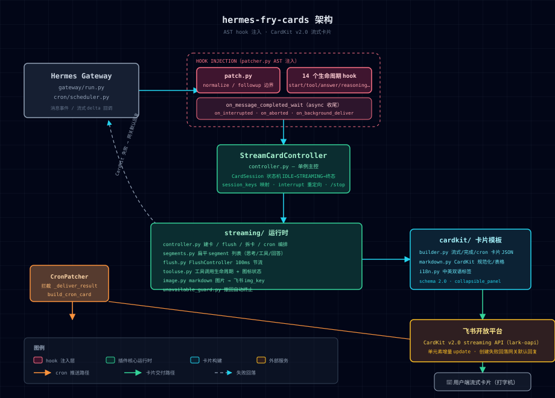

# 🍟 薯条卡片 (hermes-fry-cards)

[](LICENSE)
[](https://github.com/NousResearch/hermes-agent)
[](https://www.python.org/)
[](https://github.com/techysy/hermes-fry-cards/releases)

> 🍟 Hermes Gateway 飞书流式卡片插件 — CardKit v2.0 实时流式消息

- [English](README.en.md) · [安装指南](INSTALL.md) · [文档目录](docs/README.md) · [优化方案](docs/OPTIMIZATION_PLAN.md)

            

---

## ✨ 核心特性

| 能力 | 说明 |
|------|------|
| 🎴 **流式卡片** | AI 回复实时打字机效果，按事件顺序动态渲染思考 / 工具 / 回答 |
| 🔧 **工具调用合并** | 多个工具调用合并到统一面板，保持卡片紧凑不散乱 |
| 🧠 **推理展示** | 显示模型思考/推理内容，支持 `<thinking>` / `Reasoning:` / 原生 API 推理块 |
| 🎯 **统一面板** | 推理 + 工具合并成底部统一面板，Header 显示模型名、轮次、工具数、耗时 |
| 📊 **终态卡片** | 完成后展示完整结果 — token 用量、耗时、上下文窗口 |
| 🖼️ **图片解析** | 自动识别 markdown 图片引用，下载上传后替换为飞书 img_key |
| 🛡️ **消息保护** | 消息被删除/撤回后自动终止更新，避免无效 API 调用 |
| 📤 **卡片自动拆分** | 接近飞书 200 元素上限时自动拆分为多张卡片 |
| 🔔 **Cron 推送** | 定时任务结果以飞书卡片推送，保留 Markdown 渲染 |
| 🔙 **后台任务推送** | `/background`（`/btw`）任务完成后以卡片形式推送 |
| 🌐 **中英双语** | 卡片文本根据飞书客户端语言自动切换 |
| 🎨 **可定制样式** | header/footer、文字大小、宽度模式、字段布局均可配置 |
| 🎯 **状态色框** | 顶部 header 根据状态自动着色：流式中蓝色、完成绿色、中断/错误红色 |

## 🏗️ 架构总览



---

## 🚀 快速安装

### AI Agent 一键安装

```
curl https://raw.githubusercontent.com/techysy/hermes-fry-cards/main/INSTALL.md
```

### 手动安装

```bash
# GitHub（主仓库）
git clone https://github.com/techysy/hermes-fry-cards.git
# 或国内 Gitee 镜像（更快）
git clone https://gitee.com/techysy/hermes-fry-cards.git

cd hermes-fry-cards
HERMES_PYTHON=~/.hermes/hermes-agent/venv/bin/python3
$HERMES_PYTHON -m pip install -e .
$HERMES_PYTHON -m hermes_fry_cards verify
$HERMES_PYTHON -m hermes_fry_cards install
hermes gateway restart
```

---

## ⚙️ 配置

```yaml
streaming:
  enabled: true
  header:
    enabled: true
  footer:
    enabled: false
    fields:
      - [status, elapsed, model, context]
display:
  platforms:
    feishu:
      show_tool_use: true        # 展示工具调用面板
      show_reasoning: false      # 展示推理过程
      show_context: true         # 统一面板 header 显示上下文窗口
      context_display_mode: text # text / bar / text_bar
      max_reasoning_panels: 3    # 最多保留的独立推理面板数（超出后合并，防元素溢出）
      unified_panel_min_duration: 5  # 统一面板最小展示耗时（秒）
      truncate_model_name: true  # 截断模型名（nvidia/moonshotai/kimi-k3 → ⇲kimi-k3）
```

### 上下文显示格式

开启 `show_context` 后，统一面板 header 会显示上下文窗口使用量：

| `context_display_mode` | 显示效果 |
|------------------------|----------|
| `text`（默认） | `55.6k/1.0m (5%)` |
| `bar` | `[███▓▒░░░] 35%`（渐变阴影） |
| `text_bar` | `20k/1.0m [███▓▒░░░] 21%` |

> `block` / `block_text` 样式在桌面端/移动端显示不一致，已废弃，自动回落到 `bar` / `text_bar`。

### 配置项一览

| 配置项 | 说明 | 默认值 |
|--------|------|--------|
| `header.enabled` | 顶部状态栏 | `true` |
| `footer.enabled` | 底部元数据栏 | `false` |
| `panel_expanded` | 完成态面板保持展开 | `false` |
| `width_mode` | 卡片宽度 (`default` / `compact` / `fill`) | `default` |
| `show_tool_use` | 展示工具调用面板 | `true` |
| `show_reasoning` | 展示推理过程 | `false` |
| `show_context` | 统一面板 header 显示上下文窗口 | `true` |
| `context_display_mode` | 上下文显示格式：`text` / `bar` / `text_bar` | `text` |
| `max_reasoning_panels` | 最多保留的独立推理面板数（超出后合并，防元素溢出） | `3` |
| `unified_panel_min_duration` | 统一面板最小展示耗时（秒）；无工具调用或耗时 ≤ 此值不显示统一面板 | `5` |
| `truncate_model_name` | 截断模型名（`nvidia/moonshotai/kimi-k3` → `⇲kimi-k3`） | `true` |

### 模型别名配置

独立于 `config.yaml`，别名写在 `~/.hermes/model_aliases.json`：

```json
{
  "longcat": "哈基米",
  "gemini": "哈基米"
}
```

- **匹配**：key 对完整模型名做大小写不敏感子串匹配（`longcat` → `or/lc/LongCat-2.0` 命中）
- **优先级**：别名命中 → 显示别名；未命中 → 回落截断逻辑
- **热更新**：每次渲染重读，改完文件即生效，无需重启网关

> 完整路径：`~/.hermes/model_aliases.json`
| [模型别名](#-与上游-hermes-lark-streaming-的差异) | `~/.hermes/model_aliases.json` 子串匹配，命中优先于截断 | 无 |

### 样式效果示例

统一面板 header 的完整形态（完成态卡片底部折叠面板标题）：


| 配置组合 | header 效果 |
|---------|------------|
| `truncate_model_name: false`, `show_context: true` 纯文本 | `🍟 nvidia/moonshotai/kimi-k3 · 💭2 · 🔧3 · 152.6k/1.0m (15%) · ⏱️ 45.2s` |
| 默认（`truncate_model_name: true`） | `🍟 ⇲kimi-k3 · 💭2 · 🔧3 · 152.6k/1.0m (15%) · ⏱️ 45.2s` |
| `context_display_mode: bar` | `🍟 ⇲kimi-k3 · 💭2 · 🔧3 · [███▓▒░░░] 15% · ⏱️ 45.2s` |
| `context_display_mode: text_bar` | `🍟 ⇲kimi-k3 · 💭2 · 🔧3 · 152.6k/1.0m [███▓▒░░░] 15% · ⏱️ 45.2s` |
| `show_context: false` | `🍟 ⇲kimi-k3 · 💭2 · 🔧3 · ⏱️ 45.2s` |

> header 各部分含义：`🍟` 模型名 · `💭n` 推理轮次 · `🔧n` 工具调用数 · 上下文窗口 · `⏱️` 耗时。

> 无工具调用或回复 ≤ `unified_panel_min_duration` 秒时，整个统一面板（含 header）不显示。


---

## 🖥️ CLI 命令

```bash
HERMES_PYTHON=~/.hermes/hermes-agent/venv/bin/python3
$HERMES_PYTHON -m hermes_fry_cards verify     # 验证兼容性
$HERMES_PYTHON -m hermes_fry_cards install    # 注入 hook
$HERMES_PYTHON -m hermes_fry_cards uninstall  # 移除 hook
$HERMES_PYTHON -m hermes_fry_cards status     # 查看状态
```

---

## 📝 更新 / 卸载

### 更新

```bash
cd hermes-fry-cards && git pull
HERMES_PYTHON=~/.hermes/hermes-agent/venv/bin/python3
$HERMES_PYTHON -m pip install -e .
$HERMES_PYTHON -m hermes_fry_cards uninstall
$HERMES_PYTHON -m hermes_fry_cards install
hermes gateway restart
```

### 卸载

```bash
HERMES_PYTHON=~/.hermes/hermes-agent/venv/bin/python3
$HERMES_PYTHON -m hermes_fry_cards uninstall
$HERMES_PYTHON -m pip uninstall hermes-fry-cards
```

---

## 🧠 工作原理

```
用户发送消息
  → 创建卡片会话
  → 流式更新（工具状态、文本增量 — 节流调度）
  → 图片 URL 异步解析替换
  → 终态卡片（token/耗时/上下文）
```

### 🛡️ 稳定性保障（v0.1.1）

- **session 生命周期统一管理**：注册/清理单一入口、幂等可重入；中断接管不误删新会话映射；异常残留的终态会话允许重建，不再需要重启网关恢复
- **flush 竞态防护**：完成标记与刷新请求交叉时不会误触发多余 CardKit 调用；同一份数据不会被重复刷新
- **失败原因可追溯**：卡片失败时记录首次失败原因（`mark_failed(reason=...)`），回退网关纯文本是统一决策点

排查问题时可直接按以下标准化日志事件在 `~/.hermes/logs/agent.log` 中检索：

| 事件 | 含义 |
|------|------|
| `session_created` | 卡片会话创建 |
| `card_created` | 占位卡片发送成功 |
| `card_reply_failed` | 建卡失败（含飞书错误码），将回退纯文本 |
| `fallback_to_text` | 卡片无法收尾，交还网关默认回复（含原因 reason=...） |
| `card_complete_failed` | 完成重试 3 次耗尽 |
| `session_disposed` / `cleanup_idempotent` | 会话清理 / 重复清理被幂等吸收 |

---

## 📄 文档与报告入口

- [优化方案](docs/OPTIMIZATION_PLAN.md) — 稳定性与维护性优化方案
- [卡片设置指南](docs/CONFIGURATION.md) — 全部配置项与常用场景
- [排障指南](docs/TROUBLESHOOTING.md) — 与 hfc 插件冲突、卡片不显示、hook 未生效等常见问题
- [文档目录](docs/README.md) — 项目文档入口
- [测试报告目录](tests/reports/README.md) — 报告存放规范与入口
- **核心汉化补丁**：`skills/hermes-core-zh-localization/`（仓库内附带，安装方式见 SKILL.md）

> 说明：测试报告建议统一保存在 `tests/reports/`，并按日期/主题命名，便于后续回归对比和审计。

---

## 🔄 热更新 & 网关重启说明

本插件通过 AST 注入 hook 到 Hermes 的 `gateway/run.py` 和 `cron/scheduler.py`。**部分配置支持热更新（无需重启），但插件代码改动和部分结构类配置需要重启网关才能生效**。

### ✅ 支持热更新（改 config.yaml 后下一条消息即生效）

以下 `display` 显示 / 样式类配置项，每次渲染都会从磁盘重读，**无需重启**：

| 配置项 | 说明 |
|--------|------|
| `show_reasoning` | 展示推理过程（`/reasoning` 命令即运行时切换此配置） |
| `show_tool_use` | 展示工具调用面板 |
| `show_context` | 统一面板 header 显示上下文窗口 |
| `context_display_mode` | 上下文显示格式：`text` / `bar` / `text_bar` |
| `max_reasoning_panels` | 最多独立推理面板数（防元素溢出） |
| `unified_panel_min_duration` | 统一面板最小展示耗时（秒） |
| `truncate_model_name` | 截断模型名 |
| 模型别名 | `~/.hermes/model_aliases.json` 每次渲染重读，改文件即生效 |

### ⚠️ 需要重启网关（`hermes gateway restart`）

以下改动必须重启，运行中的进程不会热加载：

- **插件代码修改**（`git pull` 更新、改源码）
- `streaming.enabled` 开关
- `streaming.header` / `footer` / `body` / `width_mode` 等 streaming 结构类配置
- 飞书凭据 `app_id` / `app_secret`

```bash
hermes gateway restart
```

> ⚠️ 注意：`hermes gateway restart` 需要**在 gateway 进程之外的独立 shell** 中执行。
> 若从 gateway 进程内部（如通过 AI 对话让 agent 执行）触发，SIGTERM 会传播到子进程，
> 重启命令本身会被杀掉。请在本地终端手动运行。

> ✅ 重启不会损坏任何东西，可放心反复执行（**可以无限重启**）。

重启后的效果验证：`hermes_fry_cards status` 显示所有 hook `installed`，飞书渠道连接正常即可。

---

## 故障排查

| 现象 | 原因 | 解决方案 |
|------|------|----------|
| CardKit `300313` 报错 | 卡片元素接近飞书 200 上限 | 等待自动拆分 |
| Hook 丢失 | Hermes 升级覆盖了已 patch 的文件 | `verify` + `install` + 重启 |
| 流式卡片变纯文本 | CardKit 创建失败 | 日志检索 `card_reply_failed` / `fallback_to_text` 看具体原因，检查飞书凭据是否正确 |
| `status` 显示 `warning` | CLI 使用了错误的 Python 解释器 | 用 `$HERMES_PYTHON` 重新执行 |
| 卡片一直 loading 不收尾 | 完成更新失败（如元素 Duplicate ID） | 日志检索 `card_complete_failed`，确认版本 ≥ v0.1.1（含竞态修复） |

---

## 📦 镜像仓库

- **GitHub 主仓库**：[techysy/hermes-fry-cards](https://github.com/techysy/hermes-fry-cards)
- **Gitee 国内镜像**：[techysy/hermes-fry-cards](https://gitee.com/techysy/hermes-fry-cards) — 国内访问更快，与 GitHub 同步

---

## 🔗 相关项目

| 项目 | 说明 | 特性 | Stars |
|------|------|------|-------|
| [🍟 hermes-fry-cards](https://github.com/techysy/hermes-fry-cards) | 薯条卡片 — Hermes 飞书流式卡片插件 | 🎯 工具调用合并 · 统一面板 · 状态色框 | ⭐4 |
| [👸🏻 aiduPOP](https://github.com/monkey2jack/aiduPOP) | 爱嘟泡波卡 — Hermes 飞书流式卡片插件 | 🫧 泡波样式 · 透明治愈 · 灵动 UI | ⭐10 |
| [🎭 lark-hls-v2](https://github.com/BcubBo/lark-hls-v2) | 飞书 CardKit v2.0 流式卡片插件 for Hermes Agent | 🎭 二次元画风 · 动态台词 · 场景检测 · Fisher-Yates 洗牌 | ⭐7 |

---

## 🔄 与上游 hermes-lark-streaming 的差异

本项目基于 [Cheerwhy/hermes-lark-streaming](https://github.com/Cheerwhy/hermes-lark-streaming) v0.12.0 独立开发。核心流式引擎沿用上游 AST hook 注入架构，在此之上做了三层增强：

### ✨ 新增功能

| 功能 | 说明 | 上游状态 |
|------|------|----------|
| **统一面板** | 推理 + 工具调用合并到底部统一面板；`unified_panel_min_duration` 控制无工具且耗时短时自动隐藏 | ❌ 推理面板独立散排，多轮对话卡片冗长 |
| **上下文进度条** | `show_context` 独立开关 + `context_display_mode` 三种模式（`text` / 渐变阴影 `bar` / `text_bar`），智能单位（<1M 用 k） | ❌ 仅 footer 纯文本百分比，无开关 |
| **推理面板上限** | `max_reasoning_panels`（默认 3），超出合并进最后一个面板——兼容 deepseek-v4-flash 等不分段思考模型，防 300305 元素溢出 | ❌ 无限制，长思考必溢出 |
| **模型名截断** | `truncate_model_name`：`nvidia/moonshotai/kimi-k3` → `⇲kimi-k3`，修复移动端换行 | ❌ 全称显示 |
| **模型别名** | `~/.hermes/model_aliases.json` 独立 JSON 配置：`{"longcat": "哈基米", "gemini": "哈基米"}`，key 对模型名做大小写不敏感子串匹配，命中显示别名（如 LongCat → 哈基米），未命中回落截断逻辑；每次渲染重读，改文件即生效 | ❌ 无 |

行为默认值：`show_reasoning` 默认 **true**（上游默认 false）。

### 🔧 关键修复（上游存在的坑）

- **300305 元素超限强制拆卡恢复** — 卡片实际元素总数超飞书硬上限时，自动封印旧卡、未创建 segment 迁移新卡续流，不再永久卡「处理中」
- **远程图片 URL 过滤** — 规避 CardKit 拒绝远程 URL（`200570 invalid image keys`），无法上传的引用先 strip 并包代码围栏
- **完成态 Duplicate ID 修复体系** — reasoning `text_el_id` 全链路复用 + 带索引唯一 ID 兜底；上游完成态用固定 `reasoning_text` 会与流式阶段元素冲突，导致卡片卡 loading
- **seal/complete 失败清理 loading 图标** — 收尾失败不再残留「处理中」状态

### 🏛️ 内部稳定性重构（v0.1.1）

- session 生命周期统一入口（注册/清理幂等）、interrupt 后不误删新会话映射、终态会话可重建
- FlushController 竞态防护：完成态快照防误重刷、遗留 timer 取消防双刷
- `mark_failed(reason=...)` 失败原因可追溯 + 结构化日志事件 + `_yield_to_gateway` 单一回落决策点
- 测试规模 15 个文件、新增 9 个稳定性回归测试；配套 CONFIGURATION / TROUBLESHOOTING 文档

---

## 📄 归属说明

灵感来自 [hermes-lark-streaming](https://github.com/Cheerwhy/hermes-lark-streaming)（作者 Cheerwhy），原项目使用 MIT 协议。本项目为独立开发版本，已进行架构重写和功能重构。

## 📄 许可证

[MIT](LICENSE)
