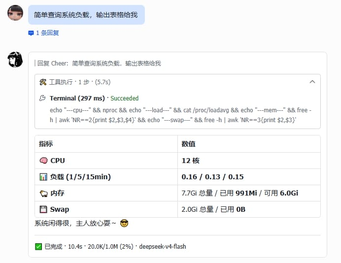

# 🍟 薯条卡片 (hermes-fry-cards)

[](LICENSE)
[](https://github.com/NousResearch/hermes-agent)
[](https://www.python.org/)
[](https://github.com/techysy/hermes-fry-cards/releases)

> 🍟 Hermes Gateway 飞书流式卡片插件 — CardKit v2.0 实时流式消息

[English](README.en.md) · [安装指南](INSTALL.md)



---

## ✨ 核心特性

| 能力 | 说明 |
|------|------|
| 🎴 **流式卡片** | AI 回复实时打字机效果，按事件顺序动态渲染思考 / 工具 / 回答 |
| 🔧 **工具调用合并** | 多个工具调用合并到统一面板，保持卡片紧凑不散乱 |
| 🧠 **推理展示** | 显示模型思考/推理内容，支持 `<thinking>` / `Reasoning:` / 原生 API 推理块 |
| 🎯 **统一面板** | 推理 + 工具合并成底部统一面板，Header 显示模型名、轮次、工具数、耗时 |
| 📊 **终态卡片** | 完成后展示完整结果 — token 用量、耗时、上下文窗口 |
| 🖼️ **图片解析** | 自动识别 markdown 图片引用，下载上传后替换为飞书 img_key |
| 🛡️ **消息保护** | 消息被删除/撤回后自动终止更新，避免无效 API 调用 |
| 📤 **卡片自动拆分** | 接近飞书 200 元素上限时自动拆分为多张卡片 |
| 🔔 **Cron 推送** | 定时任务结果以飞书卡片推送，保留 Markdown 渲染 |
| 🔙 **后台任务推送** | `/background`（`/btw`）任务完成后以卡片形式推送 |
| 🌐 **中英双语** | 卡片文本根据飞书客户端语言自动切换 |
| 🎨 **可定制样式** | header/footer、文字大小、宽度模式、字段布局均可配置 |
| 🎯 **状态色框** | 顶部 header 根据状态自动着色：流式中蓝色、完成绿色、中断/错误红色 |

---

## 🚀 快速安装

### AI Agent 一键安装

```
curl https://raw.githubusercontent.com/techysy/hermes-fry-cards/main/INSTALL.md
```

### 手动安装

```bash
git clone https://github.com/techysy/hermes-fry-cards.git
cd hermes-fry-cards
HERMES_PYTHON=~/.hermes/hermes-agent/venv/bin/python3
$HERMES_PYTHON -m pip install -e .
$HERMES_PYTHON -m hermes_fry_cards verify
$HERMES_PYTHON -m hermes_fry_cards install
hermes gateway restart
```

---

## ⚙️ 配置

```yaml
streaming:
  enabled: true
  header_enabled: true
  footer:
    enabled: true
    fields:
      - [status, elapsed, model, context]
display:
  platforms:
    feishu:
      show_tool_use: true        # 展示工具调用面板
      show_reasoning: true       # 展示推理过程
      show_context: true         # 统一面板 header 显示上下文窗口
      context_display_mode: bar  # text / bar / text_bar
      max_reasoning_panels: 3    # 最多保留的独立推理面板数（超出后合并，防元素溢出）
      unified_panel_min_duration: 5  # 统一面板最小展示耗时（秒）
      truncate_model_name: true  # 截断模型名（or/lc/LongCat-2.0 → ⇲LongCat-2.0）
```

### 上下文显示格式

开启 `show_context` 后，统一面板 header 会显示上下文窗口使用量：

| `context_display_mode` | 显示效果 |
|------------------------|----------|
| `text`（默认） | `55.6k/1.0m (5%)` |
| `bar` | `[███▓▒░░░] 35%`（渐变阴影） |
| `text_bar` | `20k/1.0m [███▓▒░░░] 21%` |

> `block` / `block_text` 样式在桌面端/移动端显示不一致，已废弃，自动回落到 `bar` / `text_bar`。

### 配置项一览

| 配置项 | 说明 | 默认值 |
|--------|------|--------|
| `header.enabled` | 顶部状态栏 | `false` |
| `footer.enabled` | 底部元数据栏 | `true` |
| `panel_expanded` | 完成态面板保持展开 | `false` |
| `width_mode` | 卡片宽度 (`default` / `compact` / `fill`) | `default` |
| `show_tool_use` | 展示工具调用面板 | `true` |
| `show_reasoning` | 展示推理过程 | `false` |
| `show_context` | 统一面板 header 显示上下文窗口 | `true` |
| `context_display_mode` | 上下文显示格式：`text` / `bar` / `text_bar` | `text` |
| `max_reasoning_panels` | 最多保留的独立推理面板数（超出后合并，防元素溢出） | `3` |
| `unified_panel_min_duration` | 统一面板最小展示耗时（秒）；无工具调用或耗时 ≤ 此值不显示统一面板 | `5` |
| `truncate_model_name` | 截断模型名（`or/lc/LongCat-2.0` → `⇲LongCat-2.0`） | `false` |

### 样式效果示例

统一面板 header 的完整形态（完成态卡片底部折叠面板标题）：

| 配置组合 | header 效果 |
|---------|------------|
| 默认（`truncate_model_name: false`, `show_context: true` 纯文本） | `🍟 or/lc/LongCat-2.0 · 💭2 · 🔧3 · 152.6k/1.0m (15%) · ⏱️ 45.2s` |
| `truncate_model_name: true` | `🍟 ⇲LongCat-2.0 · 💭2 · 🔧3 · 152.6k/1.0m (15%) · ⏱️ 45.2s` |
| `context_display_mode: bar` | `🍟 ⇲LongCat-2.0 · 💭2 · 🔧3 · [███▓▒░░░] 15% · ⏱️ 45.2s` |
| `context_display_mode: text_bar` | `🍟 ⇲LongCat-2.0 · 💭2 · 🔧3 · 152.6k/1.0m [███▓▒░░░] 15% · ⏱️ 45.2s` |
| `show_context: false` | `🍟 ⇲LongCat-2.0 · 💭2 · 🔧3 · ⏱️ 45.2s` |

> header 各部分含义：`🍟` 模型名 · `💭n` 推理轮次 · `🔧n` 工具调用数 · 上下文窗口 · `⏱️` 耗时。
> 无工具调用或回复 ≤ `unified_panel_min_duration` 秒时，整个统一面板（含 header）不显示。

---

## 🖥️ CLI 命令

```bash
HERMES_PYTHON=~/.hermes/hermes-agent/venv/bin/python3
$HERMES_PYTHON -m hermes_fry_cards verify     # 验证兼容性
$HERMES_PYTHON -m hermes_fry_cards install    # 注入 hook
$HERMES_PYTHON -m hermes_fry_cards uninstall  # 移除 hook
$HERMES_PYTHON -m hermes_fry_cards status     # 查看状态
```

---

## 📝 更新 / 卸载

### 更新

```bash
cd hermes-fry-cards && git pull
HERMES_PYTHON=~/.hermes/hermes-agent/venv/bin/python3
$HERMES_PYTHON -m pip install -e .
$HERMES_PYTHON -m hermes_fry_cards uninstall
$HERMES_PYTHON -m hermes_fry_cards install
hermes gateway restart
```

### 卸载

```bash
HERMES_PYTHON=~/.hermes/hermes-agent/venv/bin/python3
$HERMES_PYTHON -m hermes_fry_cards uninstall
$HERMES_PYTHON -m pip uninstall hermes-fry-cards
```

---

## 🧠 工作原理

```
用户发送消息
  → 创建卡片会话
  → 流式更新（工具状态、文本增量 — 节流调度）
  → 图片 URL 异步解析替换
  → 终态卡片（token/耗时/上下文）
```

---

## 故障排查

| 现象 | 原因 | 解决方案 |
|------|------|----------|
| CardKit `300313` 报错 | 卡片元素接近飞书 200 上限 | 等待自动拆分 |
| Hook 丢失 | Hermes 升级覆盖了已 patch 的文件 | `verify` + `install` + 重启 |
| 流式卡片变纯文本 | CardKit 创建失败 | 检查飞书凭据是否正确 |
| `status` 显示 `warning` | CLI 使用了错误的 Python 解释器 | 用 `$HERMES_PYTHON` 重新执行 |

---

## 🔗 相关项目

| 项目 | 说明 | 特性 | Stars |
|------|------|------|-------|
| [🍟 hermes-fry-cards](https://github.com/techysy/hermes-fry-cards) | 薯条卡片 — Hermes 飞书流式卡片插件 | 🎯 工具调用合并 · 统一面板 · 状态色框 | ⭐1 |
| [🫧 aiduPOP](https://github.com/monkey2jack/aiduPOP) | 爱嘟泡波卡 — Hermes 飞书流式卡片插件 | 🫧 泡波样式 · 透明治愈 · 灵动 UI | ⭐8 |
| [🎌 lark-hls-v2](https://github.com/BcubBo/lark-hls-v2) | 飞书 CardKit v2.0 流式卡片插件 for Hermes Agent | 🎌 二次元画风 · 动态台词 · 场景检测 · Fisher-Yates 洗牌 | ⭐7 |

---

## 📜 归属说明

灵感来自 [hermes-lark-streaming](https://github.com/Cheerwhy/hermes-lark-streaming)（作者 Cheerwhy），原项目使用 MIT 协议。本项目为独立开发版本，已进行架构重写和功能重构。

## 📄 许可证

[MIT](LICENSE)
