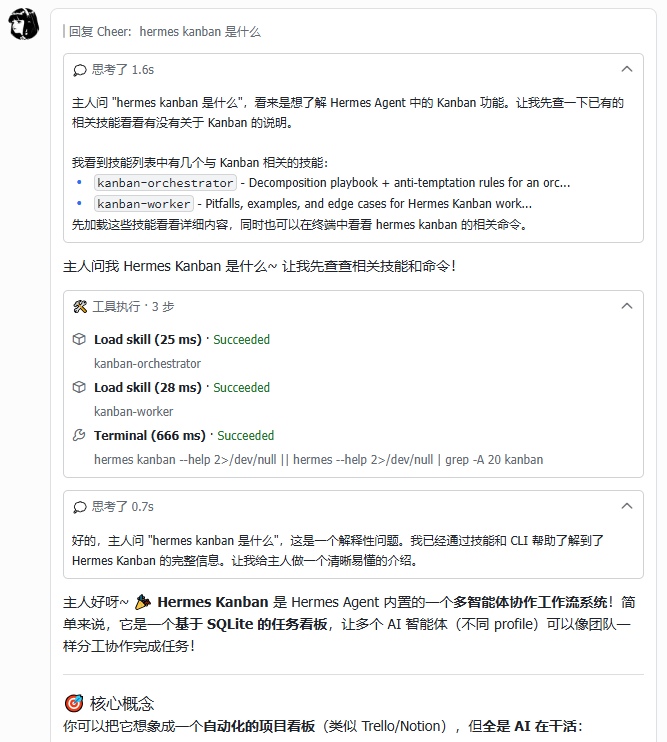
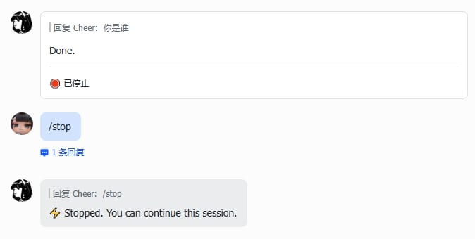
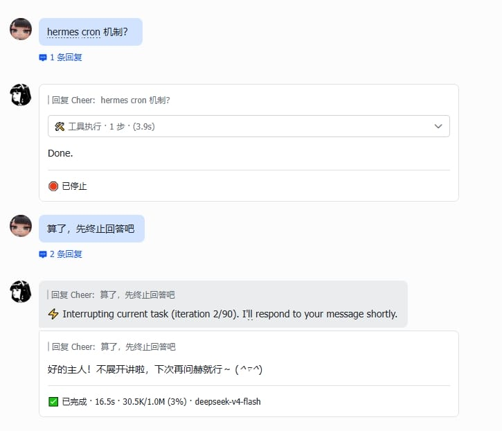

# 🍟 薯条卡片 (hermes-fry-cards)

[](LICENSE)
[](https://github.com/NousResearch/hermes-agent)
[](https://www.python.org/)

[Hermes](https://github.com/NousResearch/hermes-agent) Gateway 飞书流式卡片插件 — 基于 CardKit v2.0 的进程内流式消息卡片。

> 🍟 **独立开发版**（灵感来自 [hermes-lark-streaming](https://github.com/Cheerwhy/hermes-lark-streaming)）：重新设计「工具调用合并到卡片底部统一面板」等优化。

[English](README.en.md) · [安装指南](INSTALL.md)


---

## ✨ 功能

| 能力 | 说明 |
|------|------|
| 🎴 **流式卡片** | AI 回复实时打字机效果，按事件顺序在单张卡片内动态渲染思考 / 工具 / 回答 |
| 🔧 **工具调用合并** | 多个工具调用更新同一个 pending 面板，不再每步新建，保持卡片紧凑 |
| 🧠 **推理展示** | 显示模型思考/推理内容，支持 `<thinking>` / `Reasoning:` / 原生 API 推理块 |
| 📊 **终态卡片** | 完成后展示完整结果 — token 用量、耗时、上下文窗口 |
| 🖼️ **图片解析** | 自动识别 markdown 图片引用，下载上传后替换为飞书 img_key |
| 🛡️ **消息保护** | 消息被删除/撤回后自动终止更新，避免无效 API 调用 |
| 📤 **卡片自动拆分** | 接近飞书 200 元素上限时自动拆分为多张卡片 |
| 🔔 **Cron 推送** | 定时任务结果以飞书卡片推送，保留 Markdown 渲染 |
| 🔙 **后台任务推送** | `/background`（`/btw`）任务完成后以卡片形式推送 |
| 🌐 **中英双语** | 卡片文本根据飞书客户端语言自动切换 |
| 🎨 **可定制样式** | header/footer、文字大小、宽度模式、字段布局均可配置 |
| 🎯 **状态色框** | 顶部 header 根据状态自动着色：流式中蓝色、完成绿色、中断/错误红色 |

---

## 🖼️ 卡片展示



---

## 📋 运行要求

- Hermes `>= 0.14.0`（2026.5.16）已安装并配置飞书平台
- `Python >= 3.11`
- `lark-oapi >= 1.4.0` — 飞书/Lark 官方 Python SDK
- `PyYAML >= 6.0` — YAML 解析库
- 飞书应用权限：消息卡片（CardKit）读写、消息发送与回复、图片上传

---

## 🚀 安装

👉 完整安装步骤（手动 + AI Agent 双路径）见 **[INSTALL.md](INSTALL.md)**。

### AI Agent 一键安装

```
curl https://raw.githubusercontent.com/techysy/hermes-fry-cards/main/INSTALL.md
```

让 Hermes 对接的 AI agent 读取安装指南后自动执行。

---

## ⚙️ 配置

在 `~/.hermes/config.yaml` 中添加：

```yaml
streaming:
  enabled: true
```

### 凭据

| 优先级 | 来源 | 变量 |
|--------|------|------|
| 1 | 环境变量 | `FEISHU_APP_ID` / `FEISHU_APP_SECRET`（或 `LARK_APP_ID` / `LARK_APP_SECRET`） |
| 2 | 配置文件 | `~/.hermes/config.yaml` 中的 `feishu` 或 `lark` 区段 |

### 卡片样式

```yaml
streaming:
  enabled: true
  width_mode: default
  header:
    enabled: true
  body:
    text_size: normal_v2
  footer:
    enabled: true
    text_size: notation
    fields:
      - [status, elapsed, context, model]
    show_label: false
  panel_expanded: false
display:
  platforms:
    feishu:
      show_tool_use: true
```

| 配置项 | 说明 | 默认值 |
|--------|------|--------|
| `header.enabled` | 顶部状态栏（流式中蓝色、完成绿色、中断红色） | `false` |
| `footer.enabled` | 底部元数据栏 | `true` |
| `body.text_size` | 正文字字大小 | `normal_v2` |
| `footer.text_size` | Footer 文字大小 | `notation` |
| `footer.fields` | Footer 字段布局（二维数组） | `[status, elapsed, context, model]` |
| `footer.show_label` | 是否展示字段标签 | `false` |
| `panel_expanded` | 完成态面板保持展开 | `false` |
| `width_mode` | 卡片宽度模式 (`default` / `compact` / `fill`) | `default` |
| `show_tool_use` | 展示工具调用面板 | `true` |

---

## 🖥️ CLI 命令

```bash
HERMES_PYTHON=~/.hermes/hermes-agent/venv/bin/python3
$HERMES_PYTHON -m hermes_fry_cards verify     # 验证兼容性（不修改文件）
$HERMES_PYTHON -m hermes_fry_cards install    # 注入 hook
$HERMES_PYTHON -m hermes_fry_cards uninstall  # 移除 hook
$HERMES_PYTHON -m hermes_fry_cards restore    # 从备份恢复原始文件
$HERMES_PYTHON -m hermes_fry_cards status     # 查看状态
```

---

## 🔄 更新

```bash
cd hermes-fry-cards
git pull
HERMES_PYTHON=~/.hermes/hermes-agent/venv/bin/python3
$HERMES_PYTHON -m pip install -e .
$HERMES_PYTHON -m hermes_fry_cards uninstall   # 先移除旧注入
$HERMES_PYTHON -m hermes_fry_cards verify
$HERMES_PYTHON -m hermes_fry_cards install
hermes gateway restart
```

---

## 🗑️ 卸载

```bash
HERMES_PYTHON=~/.hermes/hermes-agent/venv/bin/python3
$HERMES_PYTHON -m hermes_fry_cards uninstall
$HERMES_PYTHON -m pip uninstall hermes-fry-cards
```

---

## 🧠 工作原理

插件通过 AST 注入在 `gateway/run.py` 和 `cron/scheduler.py` 插入 hook 调用，所有业务逻辑在 `hermes_fry_cards` 包内完成。

```
用户发送消息
  → 创建卡片会话
  → 流式更新（工具状态、文本增量 — 节流调度）
  → 图片 URL 异步解析替换
  → 终态卡片（token/耗时/上下文）
```

若消息被删除/撤回，自动终止后续更新。

### 中断处理

- `/stop` 终止 — 卡片展示中断状态：



- 消息打断 — 旧卡片展示中断状态，自动为新消息创建新的流式卡片：



---

## 故障排查

| 现象 | 原因 | 解决方案 |
|------|------|----------|
| `/retry` 后卡片没出现，回复是纯文本 | `retry_event.message_id` 缺失导致 `on_message_started` 未创建 session | 正常现象，retry 走的是重新发送消息流程，流式卡片会重新创建 |
| CardKit `300313` 报错 | 卡片元素接近飞书 200 上限 | 等待自动拆分为多张卡片；若持续报错尝试缩短对话 |
| 卡片卡住不更新 | 消息被撤回/删除触发了 `UnavailableGuard` | 正常行为，撤回后自动终止更新 |
| 图片不显示 | 图片上传失败或 markdown 格式错误 | 检查图片 URL 是否可访问；确认飞书 app 有图片上传权限 |
| Footer 不显示 | `footer.enabled` 默认开启但可能被配置覆盖 | 检查 `streaming.footer.enabled: true` |
| 推理/工具面板不展开 | `panel_expanded` 默认 `false`（折叠） | 设为 `true` 保持展开 |
| Hook 丢失（Hermes 升级后无卡片） | Hermes 升级覆盖了已 patch 的文件 | 重新运行 `verify` + `install`，然后 `gateway restart` |
| `verify` 报告 `Incompatible:` | Hermes 版本不兼容 | 升级到 `>= 0.14.0` |
| 流式卡片变纯文本回复 | CardKit 创建失败，自动 fallback | 检查飞书凭据是否正确；查看 gateway 日志 |
| `status` 显示 `warning: running under ...` | CLI 使用的 Python 不是 Hermes 的 venv | 用 `$HERMES_PYTHON` 重新执行 |

---

## 注意事项

- `install` 会修改 `~/.hermes/hermes-agent/gateway/run.py` 和 `cron/scheduler.py`，自动创建 `.hermes_lark.bak` 备份
- Hermes 更新后需重新运行 `verify` + `install`
- 插件与 Hermes 内置飞书适配器互补工作：插件负责流式卡片，内置适配器负责消息收发
- 仅对飞书平台生效，其他平台不受影响

---

## 📜 归属说明

本项目灵感来源于 [hermes-lark-streaming](https://github.com/Cheerwhy/hermes-lark-streaming)（作者 Cheerwhy），原项目使用 MIT 协议开源。本项目为独立开发版本，已进行架构重写和功能重构。原项目 LICENSE 文件保留在 [LICENSE](LICENSE) 中。

---

## 📄 许可证

[MIT](LICENSE)
